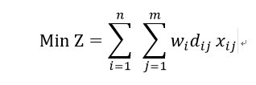

# Introduction

Healthcare infrastructure provides the basic support for healthcare operations and services, and they are essential for effective operations of healthcare systems[1]. Equity in access to health care services is a central policy goal in most publicly funded health care systems[2]. For the accessibility of healthcare facilities, a survey showed that the distance to hospitals is a key factor when patients choose the healthcare service[3]. Location of health facility is a critical factor in strategic planning of healthcare programs[4]. An efficient facility location can save cost and improve the facility utilization, and improve geographical accessibility[1].

Inequity in access to the healthcare services is a well-known challenge in many developing countries, even developed counties may also have this problem. As demographic data changes, the current healthcare facilities may not be able to meet the medical equity, especially geographical accessibility. In the meanwhile, migration may also reduce hospital benefits and result in fewer jobs. Also, the recognition of this challenge is increased based on more and more researches. In this case, new primary health care facilities are needed. 

Because of these problems, there is a need for a quantitative methodology that allow health planners to identify potential locations for a new clinic. To solve this location-allocation problem, p-Median model is beneficial. As for research questions, this study want to know what are the important factors of each facility service and test if this p-Median model adapts to this problem. The objective of this research is trying to find the optimal location of new facilities in Erie county considering both benefits and fairness. In this study, I mainly consider the persons who are potential patients.

# Materials and methods

## Packages
Here are the pacakges needed for this study.

```{r,warning=FALSE,message= FALSE,results="hide"}
library(ggmap)
library(tbart)
library(dplyr)
library(raster)
library(rgeos)
library(tigris)
library(ggplot2)
library(GISTools)
library(acs)
library(leaflet)
library(rgdal)
library(tidycensus)

```

##Data
My study area is Erie couty of NEW YORK state. 

**1.locations of the fixed clinics**  
The locations of fixed clinics are acquired from Erie County, NY Department of Health  
<http://www2.erie.gov/health/index.php?q=locations>  
To get the lontitude and latitude of these locations, geocode function in ggmap package is used based on Google Map. Because the searching results are not stable, they are saved to be output as a file(csv). Their locations are shown below.

```{r,warning=FALSE,message= FALSE,results="hide"}
point=read.csv("data/points.csv")
point
EireMap=qmap('erie county',zoom=13,color='bw')
EireMap+geom_point(aes(x=lon,y=lat),colour='red',size=4,data=point)

```

**2.census data**  
The census data are from American Community Survey (ACS) for 2011-2015 five years. Package tidycensus is used to load the data. Since the attributes are a little bit more, they are saved as an shapefile.

```{r,warning=FALSE,message= FALSE,results="hide"}
## 
erie=readOGR(dsn="data",layer ="ErieData_tract")
```

## Methods
This study use p-Median problem to sovele the question. P-median problem is the problem of locating P "facilities" relative to a set of "customers" such that the sum of the shortest demand weighted distance between "customers" and "facilities" is minimized.

P-Median problem has practical applications in a wide variety of planning problems: locating telephone switching centers [5], school districting [6], and bank location [7]. Chardaire Nooradelena and Noraida [8] used the p-median problem to determine the best location to place a limited number of emergency medical services taking into account the uncertainty in the demand for the emergency services. This study will test if p-Median model adapts to clinic problem.

**1.Calculate weight distance**  
The objective equation of p-Median peoblem is:
    
wi: weight at location i  
dij: distance between i and j  
xij= 0,1

This study mainly considers the persons who are potential patients. I would like to choose several factors to determine the potential locations including households with persons under 18 years and older than 65 years, poverty, peole under disability status, and Women who had a birth in the past 12 months.The equation of weight is:  
Wi = (Pi + Di + Yi+ Oi+ Bi)  
i:    index of a cell  
Pi: people under poverty level   
Di: people with disability status  
Yi: households with person under 18 years  
Oi: households with person older than 65 years  
Bi: women who had a birth in the past 12 months 

To get the weight of each tract, I need to transform each attribute into numeric values. Then, use the equation above to create a new column as weight. euc.dists function is used to calculate the distances between tracts. Finally, create a matrix by using weight multiplying distance. This matrix serves as weighted distance.

```{r,warning=FALSE,message= FALSE,results="hide"}
erie$B00001e1=as.numeric(as.character(erie$B00001e1))
erie$B11005e2=as.numeric(as.character(erie$B11005e2))
erie$B11007e2=as.numeric(as.character(erie$B11007e2))
erie$B13002e2=as.numeric(as.character(erie$B13002e2))
erie$B17001e2=as.numeric(as.character(erie$B17001e2))
erie$disability=as.numeric(as.character(erie$disability))
## get weight
erie2=mutate(erie@data,weight=B11005e2+B11007e2+B13002e2+B17001e2+disability)
weight=dplyr::select(erie2,GEOID,weight)
erie3=geo_join(erie,weight,"GEOID","GEOID")
eucdist<-euc.dists(erie3,erie3)
dist<-matrix(0,237,237)
for (i in 1:237)
{
  dist[i,]<-erie3$weight[i]*eucdist[i,]
}
```

**2.Create potential sites**  
For this research, tracts are used as spatial resolution. First, It is necessary to identify the tracts which contain the fixed clinics. And then create new spatial objects to be used as potential sites by deleting the fixed clinics. It shows that there are four tracts that already have clinics. 

```{r,warning=FALSE,message= FALSE,results="hide"}
## transfer points into spatial points
coordinates(point)=~lon+lat
projection(point)=erie3@proj4string  
crs=CRS("+proj=longlat +datum=NAD83 +no_defs +ellps=GRS80 +towgs84=0,0,0")
## find the tracts that contains points 
point_over=sp::over(point,erie3)
all_OBJECT=dplyr::select(erie3@data,OBJECTID)
all_OBJECT$OBJECTID=as.numeric(as.character(all_OBJECT$OBJECTID))
OBJECT=dplyr::select(point_over,OBJECTID)
OBJECT$OBJECTID=as.numeric(as.character(OBJECT$OBJECTID))
point_number=matrix(0,nrow = 5,ncol=2)
p1=which(all_OBJECT == OBJECT$OBJECTID[1], arr.ind=T)
p2=which(all_OBJECT == OBJECT$OBJECTID[2], arr.ind=T)
p3=which(all_OBJECT == OBJECT$OBJECTID[3], arr.ind=T)
p4=which(all_OBJECT == OBJECT$OBJECTID[4], arr.ind=T)
p5=which(all_OBJECT == OBJECT$OBJECTID[5], arr.ind=T)
point_number=rbind(p1,p2,p3,p4,p5)
point_number
erie_sub=erie3[-c(26,180,213,214),]

```

**3.Determine the value of p**  
To use p-median model, it is important to determine the value of p which indicates the number of facilities. Here, this research selects p value varying from 1 to 20, and then, calculate the sum of all distances from tracts to selected locations to serves as score. This study makes a tradeoff curve to decide which value of p is most efficient.

```{r,warning=FALSE,message= FALSE,results="hide"}
##p-median model 
score<-c()
for (i in 1:20){ans<-allocations(swdf1 = erie3,swdf2=erie_sub,metric=dist,p=i,verbose=T)
ans_unique <- unique(ans$allocation)
score[i]<- sum(ans$allocdist)}

```
Here, this study chooses p equals to five to do the analysis. Assuming there is no clinics, 10 is also used as the value of p to make a comparison. In addition, use p equals to 9 and force the model to select the 4 tracts with clinics inside to ba a comparison.

```{r,warning=FALSE,message= FALSE,results="hide"}
ans5=allocations(swdf1=erie3,swdf2=erie_sub,metric=dist,p=5,verbose=T)
ans_10=allocations(erie3,metric=dist,p=10,verbose = T)
ans_9=allocations(erie3,metric = dist,p=9,force = c(26,180,213,214),verbose = T)
```


# Results {.tabset}

## **1.Some attributes of Erie county**   
According to the data analysis, some important attributes are shown as below. All these attributes are count numbers. From the pictureS, we can find that the number of households with persons under 18 and over 65 is higher around the downtown in suburban areas, while people under poverty level are concentrated in dowtown. The total population, persons with disability status and women had birth in last 12 months are more evenly distributed.

```{r,warning=FALSE,message= FALSE}
##show some attributes
pal <- colorNumeric("Blues", NULL,n=6)
leaflet(erie3) %>%
  addTiles() %>%
  addPolygons(stroke = FALSE, smoothFactor = 0.3, fillOpacity = 1,
              fill = erie3$B00001e1 ,fillColor=~pal(erie3$B00001e1),
              label = ~paste0("Total population", ": ", formatC(B00001e1, big.mark = ","))) %>%
  addLegend(pal=pal, values = ~B00001e1, title="Total population/count",opacity = 1.0)

```

```{r,warning=FALSE,message= FALSE}
pal <- colorNumeric("Blues", NULL,n=6)
leaflet(erie3) %>%
  addTiles() %>%
  addPolygons(stroke = FALSE, smoothFactor = 0.3, fillOpacity = 1,
              fill = erie3$B11005e2 ,fillColor=~pal(erie3$B11005e2),
              label = ~paste0("Households with person under 18", ": ", format(B11005e2, big.mark = ","))) %>%
  addLegend(pal=pal, values = ~B11005e2, title="Households with <br> person under 18",opacity = 1.0)

```


```{r,warning=FALSE,message= FALSE}
pal <- colorNumeric("Blues", NULL,n=6)
leaflet(erie3) %>%
  addTiles() %>%
  addPolygons(stroke = FALSE, smoothFactor = 0.3, fillOpacity = 1,
              fill = erie3$B11007e2,fillColor=~pal(erie3$B11007e2),
              label = ~paste0("Households with person over 65", ": ", format(B11007e2, big.mark = ","))) %>%
  addLegend(pal=pal, values = ~B11007e2, title="Households with </br> person over 65",opacity = 1.0)

```

```{r,warning=FALSE,message= FALSE}
pal <- colorNumeric("Blues", NULL,n=6)
leaflet(erie3) %>%
  addTiles() %>%
  addPolygons(stroke = FALSE, smoothFactor = 0.3, fillOpacity = 1,
              fill = erie3$B13002e2 ,fillColor=~pal(erie3$B13002e2),
              label = ~paste0("Women had birth", ": ", format(B13002e2, big.mark = ","))) %>%
  addLegend(pal=pal, values = ~B13002e2, title="Women had birth",opacity = 1.0)

```

```{r,warning=FALSE,message= FALSE}
pal <- colorNumeric("Blues", NULL,n=6)
leaflet(erie3) %>%
  addTiles() %>%
  addPolygons(stroke = FALSE, smoothFactor = 0.3, fillOpacity = 1,
              fill = erie3$B17001e2 ,fillColor=~pal(erie3$B17001e2),
              label = ~paste0("poverty status", ": ", format(B17001e2, big.mark = ","))) %>%
  addLegend(pal=pal, values = ~B17001e2, title="people under </br> poverty status",opacity = 1.0)

```

```{r,warning=FALSE,message= FALSE}
pal <- colorNumeric("Blues", NULL,n=6)
leaflet(erie3) %>%
  addTiles() %>%
  addPolygons(stroke = FALSE, smoothFactor = 0.3, fillOpacity = 1,
              fill = erie3$disability ,fillColor=~pal(erie3$disability),
              label = ~paste0("disability status", ": ", format(disability, big.mark = ","))) %>%
  addLegend(pal=pal, values = ~disability, title="people with </br> disability status",opacity = 1.0)

```


```{r,warning=FALSE,message= FALSE}
pal <- colorNumeric("Reds", NULL,n=6)
leaflet(erie3) %>%
  addTiles() %>%
  addPolygons(stroke = FALSE, smoothFactor = 0.3, fillOpacity = 1,
              fill = weight,fillColor=~pal(weight),
              label = ~paste0("weight", ": ", formatC(weight, big.mark = ","))) %>%
  addLegend(pal=pal, values = ~weight, title="weight",opacity = 1.0)

```

  
## **2.p-Median problem results** 
As for the tradeoff, it shows that the score decreases slowly after the value of p equals to 5. Here, I choose to visualize the figure of p equals to 5 to balance the efficiency and costs. I find that most of the selected sites are around the buffalo downtown. 

```{r,warning=FALSE,message= FALSE,results="hide"}
##p-median model 
plot(score,type='b',main='Weighted distance versus P-values',xlab="p")
```


```{r,warning=FALSE,message= FALSE,results="hide"}
plot(ans5,border='grey')
shading.ans5=auto.shading(ans5$allocdist,n=6)
shading.ans5$cols=add.alpha(brewer.pal(6,"Blues"),0.7)
choropleth(ans5,v=ans5$allocdist,add=T,shading = shading.ans5)
choro.legend(-78.4,43,sh=shading.ans5,title="distance/feet",cex = 0.85)
plot(star.diagram(ans5),col='red',lwd=1,add=TRUE)
points(point,col="yellow",pch=10)
legend(-78.4,43.1,legend="fixed clinics",pch = 10,col="yellow")
```
 
If assume there is no clinics, the graphy below shows that the results of p equals to 10. It shows that the selected sites are more evenly distributed, but may not so economical. Another image represents the situation when we force to select the four tracts which contain fixed clinics. This results are similar with results before, and they are both around the buffalo downtown. The difference is that some selected potential sites are a little further from the downtown which significantly reduce the distances to clinics from remote areas.

```{r,warning=FALSE,message= FALSE,results="hide"}
plot(ans_10,border='grey')
shading.ans_10=auto.shading(ans_10$allocdist,n=6)
shading.ans_10$cols=add.alpha(brewer.pal(6,"Blues"),0.7)
choropleth(ans_10,v=ans_10$allocdist,add=T,shading = shading.ans_10)
choro.legend(-78.4,43,sh=shading.ans_10,title="distance/feet",cex = 0.85)
plot(star.diagram(ans_10),col='red',lwd=1,add=TRUE)
points(point,col="yellow",pch=10)
legend(-78.4,43.1,legend="fixed clinics",pch = 10,col="yellow")
```

```{r,warning=FALSE,message= FALSE,results="hide"}
plot(ans_9,border='grey')
shading.ans_9=auto.shading(ans_9$allocdist,n=6)
shading.ans_9$cols=add.alpha(brewer.pal(6,"Blues"),0.7)
choropleth(ans_9,v=ans_9$allocdist,add=T,shading = shading.ans_9)
choro.legend(-78.4,43,sh=shading.ans_9,title="distance/feet",cex = 0.85)
plot(star.diagram(ans_9),col='red',lwd=1,add=TRUE)
points(point,col="yellow",pch=10)
legend(-78.4,43.1,legend="fixed clinics",pch = 10,col="yellow")

```


### End


# Conclusions
Through this research, I find that it is practical to use p-Median model to solve allocation porblems of clinics. The results is consistent with what I expected. According to the results, When p is equal to 5, the model is most effective in Erie county. Comparing the three attempts, the third result can better meet both benefits and fairness when we force to select the four tracts which contain fixed clinics and consider there is no fixed clinics. To sum up, the optimal locations are around Buffalo downtown and in the suburbs where most of residents live.

Although p-Median problem is suitable for this research, there are still some problems. First, the areas of tracts are different, and it is not resonable to use tract as a unit area. In addition, considering travel time or travel distance from tracts to fixed clinics as a factor will make this study more reasonable. But I did not find a suitable method in R to calculate travel time. Also, the health care system is very complex including hospitals, nursing Homes, diagnostic and Treatment Centern and so on. Different type of facility may be affected by different factors. More detailed studies are needed. Last but not least, even though the locations of fixed clinics are acquired from official website, the real facts may be more complicated.

# References
1. Q.Peng, H.Afshari(2014) Challenges and Solutions for Location of Healthcare Facilities. Ind Eng Manage 3:127. doi:10.4172/2169-0316.1000127
2. D.Isaksson, P.Blomqvist, U.Winblad(2016)Free establishment of primary health care providers: effects on geographical equity. BMC Health Services Research 16:28. doi:10.1186/s12913-016-1259-z.
3. Yantzi N, Rosenberg MW, Burke SO, Harrison MB(2001)The impacts of
distance to hospital on families with a child with a chronic condition. Soc Sci
Med 52: 1777-1791.
4. Pons PT, Haukoos JS, Bludworth W, Cribley T, Pons KA, et al(2005)Paramedic
response time: does it affect patient survival? Acad Emerg Med 12: 594-600.
5. S. L. Hakimi(1964)Optimization Locations of Switching Centers
and the Absolute Centers and Medians of a Graph,Operations Research 12(3): 450-459.
doi:10.1287/opre.12.3.450
6. F. Ndiaye, B. Ndiaye and I. Ly(2012) Application of the p-Median Problem in School Allocation. American Journal of Operations Research 2(2): 253-259. 
doi: 10.4236/ajor.2012.22030
7. D.Willer(1990)A Spatial Decision Support Systemfor Bank Location: A Case Study.NCGIA Technical Report,90(9).
8. M. R. Nooradelena and A. G. Noraida, “An Application of the p-Median Problem with Uncertainty in demand in Emergency Medical Services,” Proceedings of the 2nd IMT-GT Regional Conference on Mathematics, Statistics and Applications, Universiti Sains Malaysia, Penang, 13-15 June 2006.
